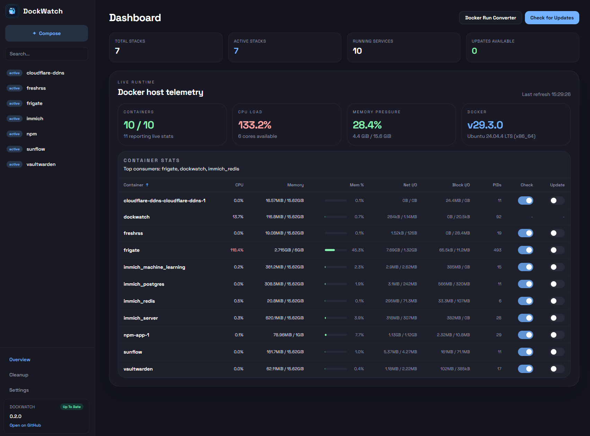
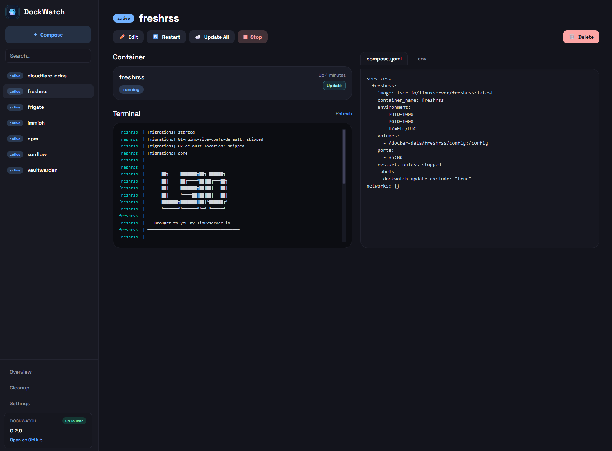
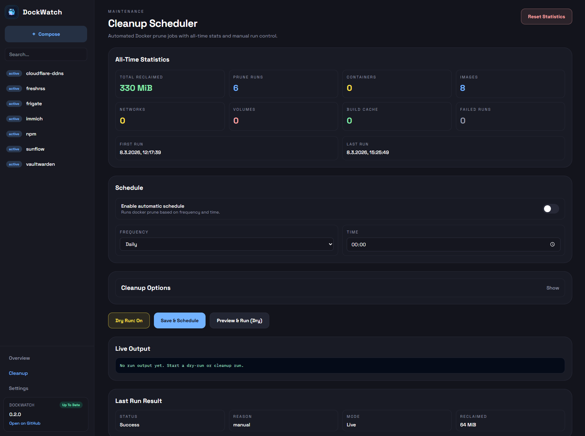

<div align="center">

# 🐳 DockWatch

[](https://github.com/robotnikz/dockwatch/stargazers)
[](https://github.com/robotnikz/dockwatch/issues)
[](https://github.com/robotnikz/dockwatch/commits/main)
[](https://github.com/robotnikz/dockwatch/actions/workflows/ci.yml)
[](https://github.com/robotnikz/dockwatch/pkgs/container/dockwatch)
[](https://opensource.org/licenses/MIT)
[](https://docs.docker.com/compose/)

*A modern, lightweight Docker Compose control surface originally vibe‑coded for personal homelab use, bridging the gap between existing tools.*

</div>

---

> **Note**: DockWatch was built primarily as a private project because I always felt a few crucial features were missing from other homelab tools. It was "vibe-coded" to fit my exact needs, but is now heavily polished and available for anyone facing the same pain points. It's now the only tool I need to manage Docker.


## ✨ Features at a Glance

* 📦 **Stack Management** — Create, edit, start, stop, update, and delete Docker Compose stacks via a clean web UI.
* 📊 **Live Runtime Dashboard** — Real-time telemetry for CPU, Memory, Network, Block I/O, and PIDs directly on the dashboard.
* 🔄 **Smart Auto-Updates & Exclusions** — Pull and recreate existing stacks with a single click. **Exclude specific containers from updates permanently with a simple GUI toggle.**
* 🎛️ **Resource Limits GUI** — Easy CPU and **RAM limits/reservations straight from the UI** without handwriting YAML config limits. It syncs directly to your compose.yaml!
* 💻 **Real-Time Live Console** — Watch your Docker Compose process outputs and errors stream live directly inside a dockge-like overlay modal.
* 🔔 **Discord Notifications** — Get instantly notified about available updates, automated checks, and stack actions via Discord webhooks.
* 🪄 **Docker Run Converter** — Turn any `docker run` shell command instantly into a deployable `compose.yaml`.

---

## 🖼️ Screenshots

Real screenshots with sanitized placeholder data. No private hostnames, secrets, or internal IPs are shown.

### Dashboard



### Stack Editor



### Prune Assistant



---

## 🙌 Shoutout to the Ecosystem

DockWatch was not built because other tools are bad. It was built because this ecosystem is full of great ideas worth building on.

Huge respect to:
- **Dockge** for the clean compose-first workflow
- **Portainer** for powerful all-in-one container management
- **Podman** / **Podman Desktop** for rootless-first container workflows
- and also **Watchtower**, **Dozzle**, **Lazydocker**, **Tugtainer** and many other OSS projects that make homelab and self-hosting better every day

DockWatch is ultimately my personal mix of the things I love most about these projects.
If you use these tools, please support the maintainers with stars, feedback, contributions, or sponsorship.

---

## 🆚 Honest Comparison

Why build another Docker interface? Here is how DockWatch fits into the existing ecosystem:

| Feature / Aspect | 🐳 DockWatch | 🗂️ Dockge | 🚢 Portainer | 🦭 Podman |
| :--- | :--- | :--- | :--- | :--- |
| **Primary Focus** | Homelab Compose management & seamless updates | Minimalist homelab Compose stack management | Enterprise container, Swarm & K8s management | Daemonless, rootless containers & Pods |
| **Auto-Updating** | Built-in (Cron + 1-Click + Discord alerts) | Requires external tools (e.g., Watchtower) | Paid features or external tooling required | Native via `systemd` auto-updates |
| **Resource Limits** | Native GUI controls for CPU & RAM | Hand-write YAML | Heavy native GUI | Podman Desktop GUI / CLI |
| **Architecture** | React 19 + Tailwind + Node.js (Vibe-coded) | Vue.js + Node.js (Robust vanilla) | AngularJS + Go (Heavy) | Go (CLI) + Desktop App |
| **Ease of Use** | Extremely High | Extremely High | Moderate (cluttered UI) | Moderate (CLI focused) |

---

## 🚀 Quick Start


```bash
# Create directories
mkdir -p /opt/stacks /opt/dockwatch
cd /opt/dockwatch

# Download the default compose file
curl -o docker-compose.yml https://raw.githubusercontent.com/robotnikz/dockwatch/main/docker-compose.yml

# Spin up DockWatch
docker compose up -d
```

Open **http://localhost:3000** in your browser.

## ⚙️ Configuration (Compose)

```yaml
services:
  dockwatch:
    image: ghcr.io/robotnikz/dockwatch:latest
    container_name: dockwatch
    restart: unless-stopped
    ports:
      - "3000:3000"
    volumes:
      - /var/run/docker.sock:/var/run/docker.sock
      - ./data:/app/data
      # ⚠️ Stacks path MUST be identical on host and container!
      - /opt/stacks:/opt/stacks
    environment:
      - DOCKWATCH_STACKS=/opt/stacks
      - PORT=3000
```

### Environment Variables

| Variable | Default | Description |
|---|---|---|
| `PORT` | `3000` | Web UI port |
| `DOCKWATCH_DATA` | `/app/data` | Database storage path |
| `DOCKWATCH_STACKS` | `/opt/stacks` | Compose stacks directory |

---

## 🔒 Security & Deployment Recommendations

DockWatch undergoes routine automated security audits, including CodeQL scanning, dependabot vulnerability assessments, and strict linting. 

**However, mounting the Docker socket (`/var/run/docker.sock`) grants root-level execution capabilities to the container.** 

**Best Practices:**
1. **Never expose DockWatch directly to the public internet.**
2. Restrict access to local networks (LAN) or secure VPN overlays like **Tailscale**, **WireGuard**, or **Zerotier**.
3. If remote access is strictly required, use an authenticating reverse proxy (like Cloudflare Access, Authelia, or Authentik) with Multi-Factor Authentication.

---

## 🏗️ Architecture Stack

- **Backend:** Node.js, Express, `better-sqlite3`, TypeScript, Docker CLI proxying.
- **Frontend:** React 19, Vite, Tailwind CSS, `ansi_up` for proper terminal stream rendering.
- **CI/CD:** GitHub Actions with `semantic-release` directly deploying to GitHub Container Registry (GHCR).

## 📄 License

This project is licensed under the [MIT License](LICENSE).
