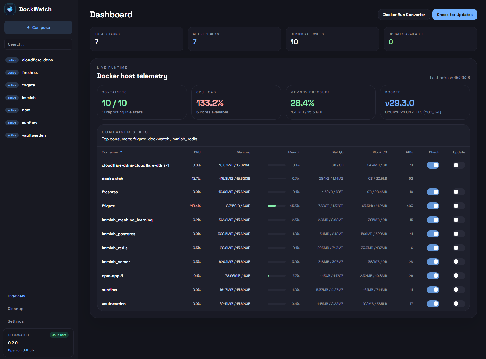
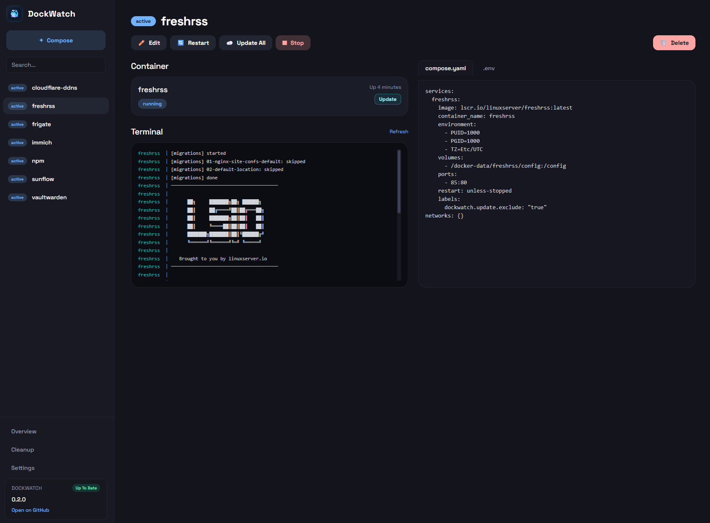
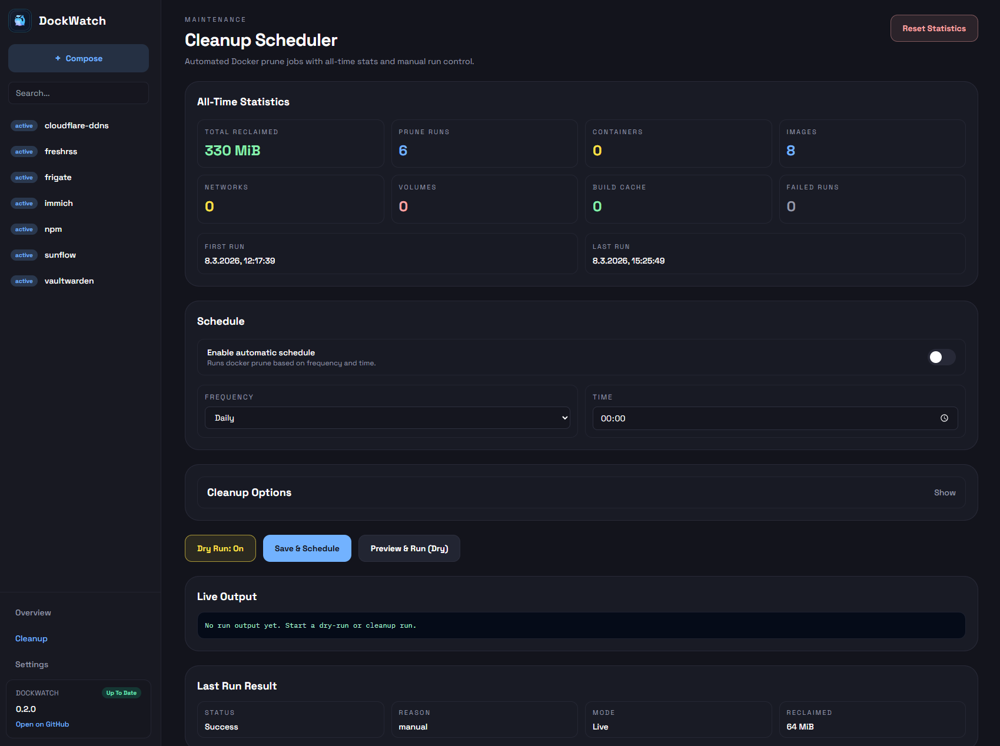

<div align="center">

# 🐳 DockWatch

[](https://github.com/robotnikz/dockwatch/stargazers)
[](https://github.com/robotnikz/dockwatch/issues)
[](https://github.com/robotnikz/dockwatch/commits/main)
[](https://github.com/robotnikz/dockwatch/actions/workflows/ci.yml)
[](https://github.com/robotnikz/dockwatch/pkgs/container/dockwatch)
[](https://opensource.org/licenses/MIT)
[](https://docs.docker.com/compose/)

*A modern, lightweight Docker Compose control GUI for personal homelab use, bridging the gap between existing tools.*

</div>

---

> DockWatch started as a private homelab project to solve gaps I kept hitting in daily Docker Compose operations. It is now polished, tested, and available for anyone facing the same pain points.

## Contents

- [Features](#-features)
- [Quick Start](#-quick-start)
- [Configuration](#%EF%B8%8F-configuration-compose)
  - [Environment Variables](#environment-variables)
  - [Stack variables (`.env`)](#stack-variables-env)
  - [Updates](#updates)
  - [Self-update](#self-update)
- [Authentication](#-authentication)
- [Screenshots](#%EF%B8%8F-screenshots)
- [Security](#-security--deployment-recommendations)
- [Architecture](#%EF%B8%8F-architecture-stack)
- [Honest Comparison](#-honest-comparison)
- [Shoutout](#-shoutout-to-the-ecosystem)
- [License](#-license)


## ✨ Features

* 📦 **Stack Management** — Build, deploy, and manage Docker Compose stacks via a clean, intuitive web UI, including each stack's `.env` file.
* 🕘 **Version History** — Every save keeps the previous `compose.yaml`/`.env` (last 20 per stack), restorable from the editor.
* 📊 **Live Runtime Dashboard** — Real-time metrics for CPU, Memory, Network, Block I/O, and PIDs at a glance.
* 🔄 **Smart Updates & Exclusions** — Pull and redeploy stacks or single services with one click. Optional scheduled auto-updates recreate only running services with new images. **Exclude specific containers from updates permanently with a simple toggle.**
* 🎛️ **Visual Resource Limits** — Control CPU and **RAM limits/reservations directly from the UI** without manual YAML editing. Changes sync instantly to your `compose.yml`!
* 💻 **Live Terminal Streaming** — View Docker Compose logs and process outputs in real-time through a responsive overlay.
* 🧹 **Prune Assistant** — Preview and clean up unused containers, images, networks, volumes and build cache, manually or on a schedule, with label-based protection.
* 🔔 **Discord Notifications** — Stay informed about available updates, stack actions, crashed or unhealthy containers, cleanup runs and scheduler errors via Discord webhooks.
* 🪄 **Docker Run to Compose** — Instantly transform `docker run` commands into deployable `compose.yml` configurations.
* 🔐 **Built-in Authentication** — Persistent local account setup on first run, login sessions, logout, and in-app password change.
* ⬆️ **One-Click Self-Update** — Update DockWatch itself from the sidebar when a new release is out.

---

## 🚀 Quick Start

```bash
# Create directories
mkdir -p /opt/stacks /opt/dockwatch
cd /opt/dockwatch

# Download the default compose file
curl -o docker-compose.yml https://raw.githubusercontent.com/robotnikz/dockwatch/main/docker-compose.yml

# Spin up DockWatch
docker compose up -d
```

Open **http://<SERVER-IP>:3000** in your browser (replace `<SERVER-IP>` with your server's actual IP address).

On first start, DockWatch opens a setup page to create the initial admin user.

> Security note: DockWatch needs Docker API access (`/var/run/docker.sock`). Keep it on LAN/VPN or behind an authenticated reverse proxy.

## ⚙️ Configuration (Compose)

```yaml
services:
  dockwatch:
    image: ghcr.io/robotnikz/dockwatch:latest
    container_name: dockwatch
    restart: unless-stopped
    ports:
      - "3000:3000"
    volumes:
      - /var/run/docker.sock:/var/run/docker.sock
      - ./data:/app/data
      # ⚠️ Stacks path MUST be identical on host and container!
      - /opt/stacks:/opt/stacks
    environment:
      - DOCKWATCH_STACKS=/opt/stacks
      - PORT=3000
```

### Environment Variables

| Variable | Default | Description |
|---|---|---|
| `PORT` | `3000` | Web UI port |
| `DOCKWATCH_DATA` | `/app/data` | Database and version history storage path |
| `DOCKWATCH_STACKS` | `/opt/stacks` | Compose stacks directory |
| `DOCKWATCH_ALLOWED_REGISTRIES` | Docker Hub, ghcr.io, quay.io, lscr.io, mcr.microsoft.com | Comma-separated registry hosts the update checker may contact |
| `DOCKWATCH_COMPOSE_TIMEOUT_MS` | `1800000` (30 min) | Upper limit for one `docker compose` pull/up/down run before it is stopped |
| `DOCKWATCH_MAX_CONCURRENT_COMPOSE_OPS` | `3` | How many `docker compose` commands may run at the same time (operations on the same stack always run one after another) |
| `DOCKWATCH_COMPOSE_ENV_PASSTHROUGH` | – | Comma-separated variables of the DockWatch container that `docker compose` should see (see below) |
| `DOCKWATCH_SELF_UPDATE_ENABLED` | `true` | Set to `false` to hide the one-click self-update |
| `DOCKWATCH_CORS_ORIGINS` | – | Comma-separated extra browser origins allowed to call the API (LAN and localhost origins are always allowed) |
| `DOCKWATCH_CORS_ALLOW_ALL` | `false` | Set to `true` to allow any origin (not recommended) |
| `GITHUB_TOKEN` | – | Optional token for the DockWatch release check, avoids GitHub API rate limits |

### Stack variables (`.env`)

Each stack can have a `.env` file next to its compose file (editable in the `.env` tab). Compose uses it for `${VAR}` substitution. New `.env` files are created with mode `600`.

DockWatch runs `docker compose` with a minimal environment (`PATH`, `HOME`, `TZ`, `DOCKER_*` and proxy variables), so its own variables such as `PORT` never override values from a stack's `.env`. If your stacks rely on a variable set on the DockWatch container, list it in `DOCKWATCH_COMPOSE_ENV_PASSTHROUGH`.

### Updates

- **Update check**: runs on the schedule from *Settings → Update Checker* and once shortly after startup. Startup only checks, it never applies updates. Discord announces each new image version once.
- **Auto-update** (on by default, toggle in *Settings*): on scheduled runs, services with a new image are pulled and recreated with `docker compose up -d --no-deps <service>`. Only running services are touched; stopped stacks and services stay stopped. Add the label `dockwatch.update.exclude=true` to skip a service, or `dockwatch.update.check.exclude=true` to skip the check entirely.
- **Manual updates**: *Update All* runs `pull` and then `up -d` for the whole stack (no `down`, so containers keep running if a pull fails). The per-service *Update* button only touches that service.
- **Private registries**: mount your Docker client config read-only, e.g. `~/.docker/config.json:/root/.docker/config.json:ro`, and add the registry to `DOCKWATCH_ALLOWED_REGISTRIES`. Inline `auths` entries are supported, credential helpers are not.

### Self-update

When DockWatch runs from a compose project with the Docker socket mounted, the sidebar offers *Install update* for new releases. DockWatch then starts a short-lived helper container that runs `docker compose pull` and `up -d` for the DockWatch service, because a container cannot reliably replace itself.

Behind a `docker-socket-proxy` (see [SECURITY.md](SECURITY.md)) the button is not available; update with `docker compose pull && docker compose up -d` in the DockWatch folder.

## 🔐 Authentication

- Built-in auth is enabled by default.
- Credentials are stored persistently in the DockWatch database.
- First run requires creating an admin account in the setup screen.
- After login, you can change the password from the user menu in the sidebar.
- Sessions use HttpOnly cookies with automatic secure-cookie behavior when running behind HTTPS/reverse proxy.

---

## 🖼️ Screenshots

### Dashboard



### Stack Editor



### Prune Assistant



---

## 🔒 Security & Deployment Recommendations

DockWatch undergoes routine automated security checks on every pull request, including CodeQL scanning, Trivy filesystem scans, `npm audit`, Dependabot vulnerability alerts, and TypeScript type-checking. Published images are signed with [cosign](https://github.com/sigstore/cosign) — see [SECURITY.md](SECURITY.md) for verification and a hardened, socket-proxied deployment. 

**However, mounting the Docker socket (`/var/run/docker.sock`) grants root-level execution capabilities to the container.** 

**Best Practices:**
1. **Never expose DockWatch directly to the public internet.**
2. Restrict access to local networks (LAN) or secure VPN overlays like **Tailscale**, **WireGuard**, or **Zerotier**.
3. If remote access is strictly required, use an authenticating reverse proxy (like Cloudflare Access, Authelia, or Authentik) with Multi-Factor Authentication.

---

## 🏗️ Architecture Stack

- **Backend:** Node.js, Express, `better-sqlite3`, TypeScript, Docker CLI proxying.
- **Frontend:** React 19, Vite, Tailwind CSS, `ansi_up` for proper terminal stream rendering.
- **CI/CD:** GitHub Actions with `semantic-release` directly deploying to GitHub Container Registry (GHCR).

---

## 🆚 Honest Comparison

Why create another Docker interface? Here's where DockWatch fits in:

| Feature / Aspect | 🐳 DockWatch | 🗂️ Dockge | 🚢 Portainer CE |
| :--- | :--- | :--- | :--- |
| **Primary Focus** | Personal homelab management with automated updates | Minimalist Docker Compose management | All-in-one management for Docker, Swarm & Kubernetes |
| **Image Update Checks** | Scheduled registry checks per service, Discord alert once per new version | None (manual pull via *Update*) | Up-to-date indicators only in the paid Business Edition |
| **Auto-Updating** | Built-in, per-service opt-out; only running services are recreated | Requires external tools (e.g., Watchtower) | GitOps redeploy for Git-based stacks, optionally re-pulling images; other stacks need external tools |
| **`.env` Files** | Editor tab per stack | Editor per stack | Variables UI or `.env` upload |
| **Version History** | Last 20 versions per stack, restorable | – | Via Git for Git-based stacks |
| **Resource Limits** | GUI for CPU & RAM, written to `compose.yaml` | Manual YAML editing | GUI for containers, YAML for stacks |
| **Cleanup** | Prune assistant with preview, schedule and label protection | – | Manual removal of unused resources |
| **Multiple Hosts** | Single host | Yes (agents) | Yes (agents, Edge) |
| **Tech Stack** | React 19 + Node.js | Vue.js + Node.js | Go + TypeScript/React (migrating from AngularJS) |
| **Learning Curve** | Extremely Intuitive | Very Low | Moderate (Higher complexity) |

*Portainer details refer to the free Community Edition. Comparison checked in October 2026.*

---

## 🙌 Shoutout to the Ecosystem

DockWatch was not built because other tools are bad. It was built because this ecosystem is full of great ideas worth building on.

Huge respect to:
- **Dockge** for the clean compose-first workflow
- **Portainer** for powerful all-in-one container management
- **Podman** / **Podman Desktop** for rootless-first container workflows
- and also **Watchtower**, **Dozzle**, **Lazydocker**, **Tugtainer** and many other OSS projects that make homelab and self-hosting better every day

DockWatch is ultimately my personal mix of the things I love most about these projects.
If you use these tools, please support the maintainers with stars, feedback, contributions, or sponsorship.

---

## 📄 License

This project is licensed under the [MIT License](LICENSE).
